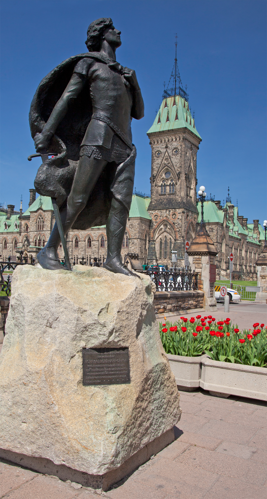

# Ottawa Medievalism

I want you to reflect on how the Middle Ages is reimagined to have contemporary relevence. The object of our inquiry is the [Harper](https://en.wikipedia.org/wiki/Henry\_Albert\_Harper) Monument on Parliament Hill. It is one of the most prominent statues on the Hill. It commemorates [Henry Albert Harper](http://www.biographi.ca/en/bio/harper\_henry\_albert\_13E.html) – a journalist and friend of future Prime Minister William Lyon Mackenzie King who died attempting to save a woman fallen into the Ottawa River. It was a cultural moment that attracted considerable attention, among other things being commemorated in poetry by William Campbell, in his poem _A_[ _Canadian Galahad_](https://archive.org/details/oxfordbookofcana00campuoft/page/162/mode/2up) (cited by MK in his account of Harper's life).&#x20;

Mackenzie King – a journalist himself at the time – headed up a government monument committee to memorialize Harper. Mackenzie King and Harper had shared an interest in Tennyson's [Arthurian works](https://archive.org/details/idyllsofking06tenn/page/n7/mode/2up), and Mackenzie King hoped that Harper would be honoured by a statue of Sir Galahad outside the parliament buildings, with an inscribed quotation from Tennyson (spoken by Sir Galahad), "If I lose myself, I save myself". The statue was accomplished by Ernest Wise Keyser and unveiled in 1905.

In 1906, Mackenzie King published [_The Secret of Heroism_](https://archive.org/details/secretofheroismm00kinguoft/page/n7/mode/2up) about Harper, about whom he recalled in his private diary as "the man I loved as I have loved no other man, my father and brother alone excepted". The statue remains on Parliament Hill to this day.

1. Please take a look at the two Government of Canada heritage information resources (a website and a short video) posted below. Get a sense of what the statue looks like and how it is officially contextualized today.
2. In small groups, you will write up a concise description and analysis of the statue. Each group will read their write-ups to the class once we come back together. As you are working together your should address the following:

* Describe the monument (ie what does it depict, what is it made of, where is it located) and pertinent information about the statue/artifact.
* Try to come up with an answer for why an early twentieth-century individual would be commemorated with a statue of a medieval warrior, and a quote from a nineteenth-century retelling of medieval romances. In essence, I want you to answer **how and why the Harper monument is a **_**medievalism**_. If needed, do a bit of quick internet research about who Mackenzie King and Henry Harper were, who Tennyson was and what his _Idylls of the King_ was about?&#x20;
* In the _Secret of Heroism_ Mackenzie King tells us about the genesis of the statue ([see bottom of p. 11 and following](https://archive.org/details/secretofheroismm00kinguoft/page/10/mode/2up); also [p. 15](https://archive.org/details/secretofheroismm00kinguoft/page/14/mode/2up), p. [17](https://archive.org/details/secretofheroismm00kinguoft/page/16/mode/2up)). Remember that this book is by no means an objective account - it is a glowing, almost hagiographic tale. IT is meant to be unrelentingly positive. For our purposes, a few things you might wish to look further at Mackenzie King talks about Harper's literary tastes here (p. [67](https://archive.org/details/secretofheroismm00kinguoft/page/66/mode/2up)) - Note the names of authors Tennyson and Matthew Arnold (also discussed in more detail here, [p. 74](https://archive.org/details/secretofheroismm00kinguoft/page/72/mode/2up)). Who are they? Mackenzie King summarizes the model offered by Harper's life at the end of this book ([here](https://archive.org/details/secretofheroismm00kinguoft/page/142/mode/2up))
* Other questions to answer:
  * Who is Sir Galahad? And how does he offer a parallel to Harper?
  * The Harper memorial is one of the few non-politicians commemorated at Parliament? Why was Harper special/ different? What does this statue say about who gets remembered and why?
  * How does colonialism/ imperialism lurk underneath this statue (at least in Mackenzie King's contextualization)?




