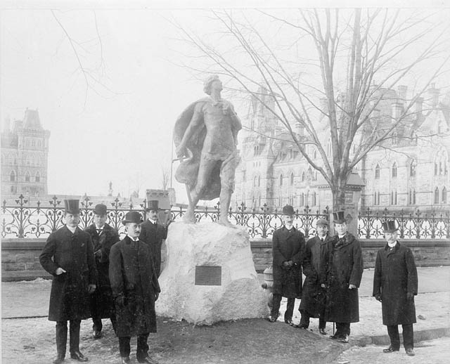

# Ottawa Medievalism

I want you to reflect on how the Middle Ages is reimagined to make it have contemporary relevence. The object of our inquiry is the [Harper](https://en.wikipedia.org/wiki/Henry_Albert_Harper) Monument near Parliament Hill downtown. 

\[from wikipedia\]

Both Mackenzie King and Harper had been fond of Tennyson's Arthurian works, and Mackenzie King decided that Harper would be honoured by a statue of Sir Galahad outside the parliament buildings, with the quote cut into the stone base. Sculptor Ernest Wise Keyser was commissioned and the statue was unveiled in 1905.

In 1906, Mackenzie King published a book [_The Secret of Heroism_](https://archive.org/details/secretofheroismm00kinguoft/page/n7/mode/2up) __about his friend whom he recalled in his diary entries as "the man I loved as I have loved no other man, my father and brother alone excepted". In 1909, King's first speech before the House of Commons was preceded by the statement that he marked the eighth anniversary of Harper's sacrifice by placing ten white roses on the base of the statue.







