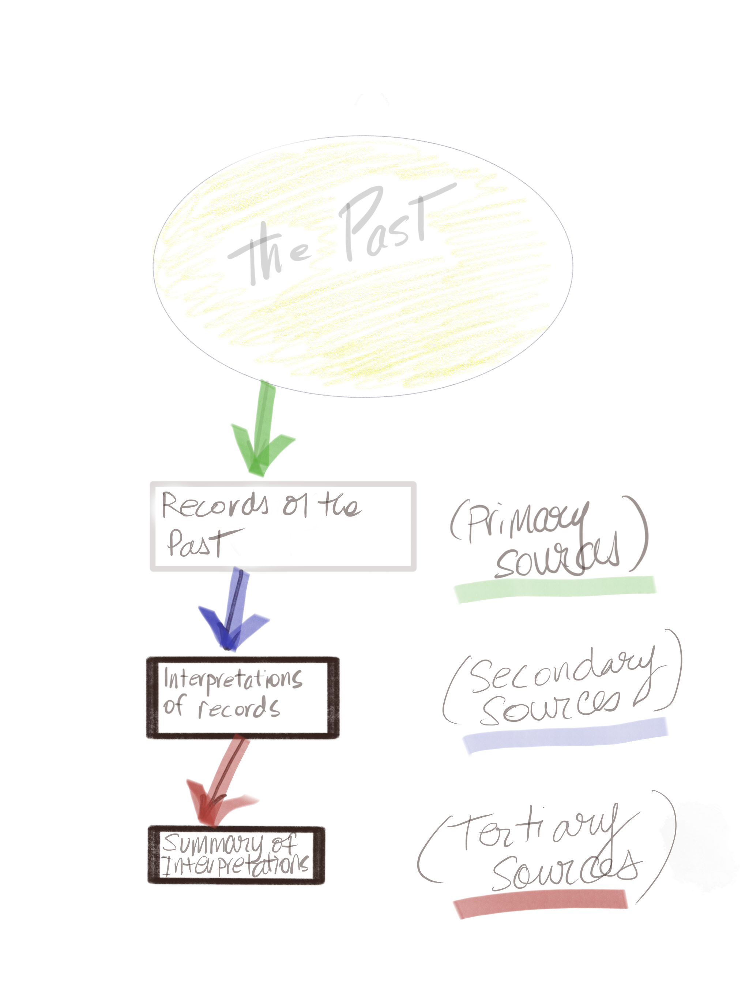

# Anatomy of a Primary Source

A primary source is anything which can be considered evidence for a particular period of history and can include written texts, oral testimony, music, paintings, architecture, or material remains such as tools, furniture and dress. Most historians rely largely on written sources, called documents. As primary sources, documents need to be distinguished from secondary sources, such as a textbook \(a book written by a professional scholar for students\) and more advanced research texts called monographs \(a book written by a professional scholar for other academic researchers and upper-level students of history\), or articles published by professional scholars in research publications \(periodicals, journals\). In general, secondary sources rely on the selection, interpretation and analysis of primary sources to make an argument about the past. Bear in mind that no single document can ever render a complete account of the past – usually historians use many different sources, and different kinds of sources to make their argument stronger.

Documents rarely “tell their own story”. They require analysis and interpretation by historians – this is your job. Since every document is different and also sheds light on a variety of matters, it will be necessary for you to select one topic that can reasonably discussed given your text\(s\). In a structured argument, your paper should describe accurately the information contained in the document\(s\) and what can be learned from them. Your paper should not simply paraphrase or retell the source text\(s\), but must organize a selection of material into an argument.

### Source Schematic

Here is a simple visualization how historians use sources:

The world of the past is vast and, ultimately unknowable in its entirety. We depend on attempts to record and represent the world of the past when we write history.

* **Primary Sources** are records that are created in the past. For understanding twelfth-century monks, for example, a historian might read a legal agreement between a donor and a monastery, could draw on archaeological remains from the monastery \(such as sculpture or pottery fragments\) or look at images of the monastery in contemporary manuscripts. Key here is the word "contemporary" i.e. records that are from the same \(_co_\) + time \(_tempus_\) as the events being studies. 


What we consider a primary source is relative. A nineteenth-century history of a twelfth-century monastery \(which we would consider a secondary source\) can also be a primary source – if we were studying "nineteenth-century attitudes to the Middle Ages". 


* **Secondary sources** are attempts by people \(often historians, but not always\) to look back and describe/ understand the past. Usually historians base their arguments and representations of the past on primary sources, but they often also refer to other secondary sources that have already been written by their time.

They can take the form of: 

* conference presentations \(the usual first step of academic inquiry is to present initial findings and thoughts in a 15-30 minute talk at a scholarly conference\). 
* journal articles \(usually narrowly-focused write up of research; can also be survey of other secondary sources - i.e. a "literature review"\). 
* monographs \(a book written on a single topic; parts of it might originally have been written up as different articles\)
* edited volumes \(a collection of essays and articles written by several people loosely organized around a single theme. Often are proceedings from conferences\).

* **Tertiary sources** are attempts to summarize what has been argued in secondary sources without engaging in original research on its own. These are sources like encyclopedias or dictionaries. They do not attempt to be cutting edge but rather summarize what is generally understood in reputable scholarship about a topic. This is why you will see on Wikipedia, for example, that an article is criticized for containing "[original thought](https://en.wikipedia.org/wiki/Wikipedia:No_original_research)" \(i.e. trying to be a secondary source\) which is something Wikipedia seeks to prohibit. 

